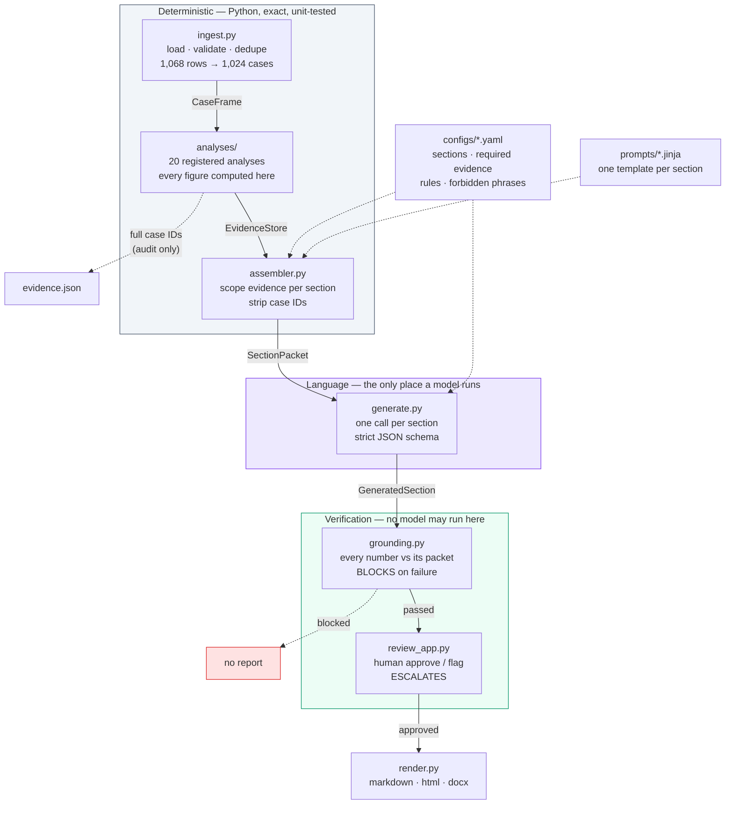

# Evidentia

A config-driven engine that turns structured safety data into controlled, traceable
regulatory reports. PADER is the first report type it knows about.

**253 numeric claims across 9 sections, 0 ungrounded.** Every figure in the generated
report traces to a Python computation, and the pipeline refuses to render if one does not.

---

## Quick start

```bash
git clone https://github.com/uditnegi16/Evidentia.git
cd Evidentia
python -m venv .venv && .venv/Scripts/activate     # Linux/macOS: source .venv/bin/activate
pip install -r requirements.txt && pip install -e .

echo "GROQ_API_KEY=your_key" > .env
# place Bisoprolol_icsr_sample_1068rows.xlsx in data/

python -m evidentia.run
```

Writes to `outputs/`: `report.md`, `report.html`, `report.docx`, plus the full audit
trail. Roughly 40 seconds and about 15,000 tokens.

```bash
streamlit run review_app.py                              # human review UI
python -m evidentia.run --evaluate full --evaluate-sample 0.3   # advisory tiers 2 and 3
python -m evidentia.run --config configs/psur_lite.yaml --out outputs/psur   # second report type
pytest -q                                                # 203 tests
```

`pytest` and `ruff check src tests` both run with **no API key and no dataset** — the
tests that need data skip themselves. That is not a convenience; it is a consequence
of keeping the LLM out of the analysis path.

---

## Architecture



Each arrow is a frozen contract, so any stage can be rewritten without touching its
neighbours:

| Stage | Emits | Consumed by |
|---|---|---|
| ingest | `CaseFrame` + `ValidationReport` | analyses |
| analyses | `EvidenceItem` with full provenance | assembler |
| assembler | `SectionPacket` — scoped, no case IDs | generate |
| generate | `GeneratedSection` — prose, evidence used, flags | grounding |
| grounding | `GroundingResult` — blocking vs review | review, render |

`generate.py` does not import pandas. `render.py` does not import groq.

---

## Where AI is used, and where it is not

| Task | Who | Why |
|---|---|---|
| Dedupe, count, group, band, explode | **Python** | Exact, reproducible, unit-testable |
| Every number in the report | **Python** | An LLM doing arithmetic is an unverifiable claim |
| Reporting Period section | **Python** | A fact table is not a language task |
| Case Index — 1,024 rows | **Python** | Asking a model to render a listing spends tokens to add risk |
| Choosing which figures matter | **LLM** | Judgement over a scoped set |
| Writing regulatory prose | **LLM** | Language |
| Verifying the prose | **Python** | A check that can hallucinate is not a check |

7 sections are generated; 2 are rendered. **The model never computes a number** — it
receives finished figures and writes sentences around them.

This split is the reason the entire pipeline below the generation boundary is testable
in CI with no secrets.

---

## Context engineering

Twenty analyses exist. **No section sees more than seven.**

| Section | Evidence declared |
|---|---|
| narrative_summary | 5 |
| summary_analysis_of_cases | 7 |
| reaction_analysis | 6 |
| serious_cases_alerts | 5 |
| trends_observations | 3 |
| history_of_actions | 2 |
| data_limitations | 2 |

Sections declare what they need in YAML; the assembler hands them exactly that. Asking
for evidence that was not computed raises rather than silently producing a thinner packet.

**Two objects, one source of truth.** Every `EvidenceItem` carries the full list of
contributing case IDs. `to_prompt_dict()` is a projection that strips them:

```
EvidenceItem ──► to_prompt_dict() ──► LLM        lean, no IDs, unit declared
             └─► model_dump()     ──► audit      complete, every case ID
```

Case IDs let a human audit a claim. They are pure noise to a language task and inflate
every call. A test asserts structurally that no case ID appears in any prompt, and that
`evidence.json` retains all of them.

### The prompt the model actually receives

Every packet is written to `outputs/packets/<section>.prompt.txt` on each run. Abridged:

```
Section: Narrative Summary and Analysis
Report: PADER for Bisoprolol
Regulatory basis: 21 CFR 314.80(c)(2)

Approved evidence for this section. These are the only figures you may state.

{
  "total_cases": {
    "label": "Total cases received", "kind": "scalar", "value": 1024,
    "provenance": { "unit": "case", "n_contributing": 1024, "denominator": 1024,
      "notes": ["1068 raw rows collapsed to 1024 cases",
                "44 rows dropped as superseded versions"] } },
  "top_reactions_by_case": {
    "label": "Most frequently reported reactions (distinct cases)",
    "buckets": [ {"label": "Acute kidney injury", "count": 80, "pct": 7.8}, ... ],
    "provenance": { "unit": "case", "denominator": 1024,
      "notes": ["counts are distinct cases; they do not sum to the case total"] } }
}

Rules:
- Use only the figures provided in the evidence packet. Do not calculate,
  estimate, extrapolate or round any number that is not given.
- Respect the unit of count on each item. Never compare or combine figures
  carrying different units.
- State observations, not conclusions. A numerical pattern is not a safety signal.
- Do not assert or deny causality between the product and any reaction.
...

Task:
Distinguish three registers and keep them separate:
  observed     what the data records, e.g. "80 cases reported acute kidney injury"
  derived      what follows arithmetically
  interpreted  reserved for a qualified reviewer; do not write in this register
```

**Static vs assembled.** The system message carries what is constant for a report type
— product, rules — so it is cacheable and identical across sections. The user message is
built per section from its declared evidence. The diff between two sections is visible
at a glance.

**`unit` reaches the model, and it matters.** Given only "80" and "3,429", a model may
divide them. Told the first counts cases and the second counts reaction events, it wrote,
unprompted: *"the most frequently reported reactions, counted by distinct cases"* and
*"reaction outcomes, recorded by reaction event"*.

---

## Grounding

Every number in generated prose is extracted and checked against the set its packet made
available. Authority is asymmetric:

| Severity | Checks | Effect |
|---|---|---|
| **blocking** | ungrounded number · forbidden phrase asserted · evidence never declared | report does not render |
| **review** | model-raised flag · negated forbidden phrase · over length · degraded output mode · no evidence cited | escalates to a human |

Nothing in this layer calls an LLM.

**Derivation is not grounding.** A test adds "99.9 percent" to otherwise-clean prose. It
is exactly 1023/1024 and arithmetically true. It blocks, because the packet did not
contain it. That test is the clearest statement of the system's thesis.

**A human cannot approve away a fabrication.** Grounding failures block regardless of
approval state — a test asserts it. Approval covers wording and judgement; numbers are
not a matter of judgement.

### What the gate caught in practice

The gate fired on live output four times. Each was a genuinely different class of problem:

| Finding | Class | Fix |
|---|---|---|
| 45, 64, 65, 74, 84 | **My bug.** Model wrote age bands with en dashes; my mask compared ASCII hyphens | Normalise 7 Unicode dash variants |
| 15 | **My bug.** "15-day Alert" is regulatory terminology | Mask interval terms |
| 1068, 938, 2025 | **My packet omission.** Real figures I computed and never sent | Harvest bucket labels and `n_contributing` into claims |
| "reporting rate" in PSUR | **My bug.** Section was *instructed* to say rates cannot be calculated | Negation-aware matching, downgrade not block |

Every fix put real figures into the packet or corrected the matcher. **The tolerance was
never loosened and no number was ever whitelisted.**

One near-miss worth recording: my first negation implementation used a window that
included the matched phrase. "no safety concerns were identified" begins with "no", so
the single most important forbidden phrase in the system excused itself — silently, while
every other test passed. Fixed by excluding the phrase from the window and dropping the
weak markers "no", "none", "never". Six tests now pin it, including one that buries a real
claim twelve sentences after an unrelated denial and confirms it still blocks.

---

## Evaluating 1,000 reports

Not one report checked well — a policy that scales.

| Tier | Mechanism | Catches | Authority | Coverage at scale |
|---|---|---|---|---|
| **1** | Number extraction vs packet; forbidden phrases; schema; completeness | Fabricated figures | **BLOCKS** | 100% — free, deterministic |
| **2** | Same packet through a second model, figures diffed | Prompt ambiguity, instability | FLAGS | ~10% sample |
| **3** | LLM judge on a rubric: overreach, interpretation, unit errors, omissions | The line between observation and interpretation | FLAGS | ~2% plus everything tiers 1–2 flagged |

**Tier 1 is the whole answer to "is it correct".** It runs everywhere at zero marginal
cost because it is deterministic.

**Tier 2 detects disagreement, not correctness.** Two models can agree and both be wrong.
It is a stability probe. `CrossCheckResult` deliberately has no `passed` attribute — a
test asserts that.

**Tier 3 is a judge that may not pass judgement.** `JudgeResult` has no `approved`,
`passed` or `score` field; a test asserts their absence. It must quote offending sentences
verbatim, and quotes not found in the prose set `quotes_verified=False`. An unparseable
judge response returns "no evaluation performed" rather than an empty-and-therefore-clean
result — failing open would let a broken evaluator look like a pass.

Tiers 2 and 3 run behind `--evaluate {cross,judge,full}` with
`--evaluate-sample`. **Sections already flagged by tier 1 are never sampled out** —
spending budget on sections nothing has questioned while skipping one that raised a flag
would invert the point. Sampling is seeded, so a run is reproducible. Results land in
`evaluation.json` and a summary in `manifest.json`.

Both tiers are advisory in code, not just in description: a tier-3 finding does not stop
a render, and an evaluator that *crashes* does not fail the run — it records the error
and continues. An advisory tier able to halt a report would outrank the deterministic
gate, which is backwards.

**Fleet metrics** from `manifest.json`, which every run writes: ungrounded-number rate,
sections needing review, output-mode degradation, tokens, and a `dataset_sha256` +
prompt/packet hash per section so any report can be attributed and reproduced.

---

## Generalisation — the second report type

The claim every submission makes is "my architecture generalises". Here it is falsifiable.

`configs/psur_lite.yaml` plus five Jinja prompts. **Zero Python files touched.**

| | PADER | PSUR-lite |
|---|---|---|
| Sections | 9 | 8 |
| Shared section IDs | — | **0** |
| Analyses required | 20 | 18 |
| Analyses reused | — | **18** |
| New analyses needed | — | **0** |
| Temperature | 0.0 | 0.1 |
| Output formats | md, html, docx | md, html |
| Forbidden phrases | 11 | 17 (strict superset) |

They share no section identifiers, so the reuse is not incidental overlap. PSUR adds
benefit-risk phrases a PADER never needed — "benefit-risk balance remains favourable",
"reporting rate" — because report types carry their own rules.

Nine tests enforce this. `test_psur_needs_no_analysis_the_pader_did_not_already_register`
fails the moment someone adds a report type requiring new computation.

**What survives a request for PSUR, PBRER, DSUR, CSR?** Ingest, the analysis registry, the
assembler, the generator, grounding, review, and all three renderers — everything except
the YAML and the prompts. A new report type needing a *new analysis* adds one registered
function; it does not touch any existing stage.

---

## Refusing to produce something misleading

Three places the system declines rather than degrades:

**Empty packets are rejected at config load.** A generated section declaring no evidence
raises before any API call, because an empty packet plus "write this section" is precisely
when a model invents content.

**Absence is stated, not omitted.** `safety_actions` and the PSUR `exposure` section exist
*because* the answer is "nothing was supplied". They give the model an explicit negative to
narrate instead of a blank to fill.

**Partial runs render nothing.** `--sections narrative_summary` writes packets and sections
for inspection and produces no report, stamped `PARTIAL — 1 of 7 generated sections; not a
report`. A document missing seven of nine sections that still looks complete is more
dangerous than a crash.

---

## Known limitations

**Data**

- **Drug ineffective: we report 54 distinct cases, the reference PADER says 53.** Four of
  five compared terms reproduce exactly (80/46/43/33) and none match before dedup, so the
  dedup policy is validated. This one case is unexplained. Tuning until it matched would be
  fitting to an artifact rather than to the data — logged open as E-011.
- **No System Organ Class field.** Reported at Preferred Term level; SOC grouping is stated
  as unavailable and never inferred. The reference PADER groups by SOC and we cannot.
- **Expectedness is out of scope.** No product label or CCDS was supplied, so
  labelled/unlabelled cannot be determined. The reference's "Serious, Unlabelled" tabulation
  is not reproducible.
- **197 duplicate-flagged cases are retained.** The flag is undefined for this exercise.
  Removing a fifth of the dataset on an unexplained flag would be an unevidenced analytical
  decision; the count is surfaced instead.
- **3 rows have a corrupt age unit** (`800`) and are quarantined, not guessed.
- **No exposure denominator**, so no rate, incidence or frequency can be stated anywhere.

**System**

- **Grounding is numeric.** It cannot catch a qualitatively wrong but arithmetically clean
  sentence. That gap is exactly what tier 3 exists for, and tier 3 only flags.
- **Masking is heuristic.** Dates, CFR citations, ordinals, interval terms and packet
  labels are masked. Each mask is narrow and a test confirms fabrications adjacent to
  masked terms still block, but a novel non-claim numeric form would produce a false
  positive.
- **Percentage tolerance is ±0.051** for one-decimal rounding. Tight enough to exclude any
  plausible fabrication, but not zero.
- **`--require-approval` is off by default** so the pipeline demonstrates in one command.
  Unapproved output is stamped `DRAFT — not human approved` and FINAL is unreachable
  without a human.
- **PSUR-lite is not a valid PSUR.** It proves the engine is report-type-agnostic. A real
  PBRER needs exposure denominators, trial data and literature review, none of which exist
  here. The config says so.
- **Review state is a JSON file.** No auth, no multi-user, no audit of who changed what and
  when. Fine for a prototype; a real deployment needs an append-only review log.
- **Cross-check and judge are off by default.** They are wired into the runner behind
  `--evaluate` and cost roughly one extra call per section per tier, so running them
  unconditionally would triple token spend for an advisory signal.
- **Strict structured output is provider-dependent.** Groq strict mode is documented for
  `gpt-oss` models only and has been reported to fail on them; the client degrades
  strict → schema → json_object and records which rung produced each section.

**What I would do next, in order:** wire tiers 2 and 3 into a `--evaluate` flag with
sampling; add previous-period comparison so trends have a cumulative baseline; replace
`review.json` with an append-only log; add a label/CCDS source so expectedness becomes
answerable.

---

## Documentation

| File | Contents |
|---|---|
| `docs/DECISIONS.md` | 18 decisions with alternatives and reasoning, including one revised when evidence contradicted it |
| `docs/ERROR_LOG.md` | 17 issues — 7 pre-registered before they occurred, the rest as found |
| `docs/OUTCOMES.md` | Verified figures per phase, and which grading criterion each component answers |

`docs/DECISIONS.md` D-017 is worth reading: I concluded the reference pipeline did not
deduplicate because one aggregate matched. Checking a second quantity showed the opposite.
The revision is left in with the original reasoning, because one coincidence is not
corroboration.

---

## Stack

`pandas` · `pydantic` v2 · `PyYAML` · `Jinja2` · `groq` · `streamlit` · `python-docx` ·
`pytest` · `ruff`

**Not used, deliberately:** LangChain/LangGraph (abstraction over a linear pipeline with no
branching), vector DB / RAG (1,068 rows of structured data — `groupby` *is* the retrieval,
and a vector index would be strictly worse), agent frameworks (no step requires dynamic
tool selection).

**Model:** `openai/gpt-oss-120b` on Groq, temperature 0, seed 7, `reasoning_effort: low`.
Chosen because Groq's strict constrained decoding is supported only on `gpt-oss` models,
and guaranteed schema conformance matters more here than raw quality.
`llama-3.3-70b-versatile` is the tier-2 cross-check model.

---

## Data notice

The dataset is synthetic, derived from public sources, and supplied for this exercise only.
It is gitignored and not included in this repository.
